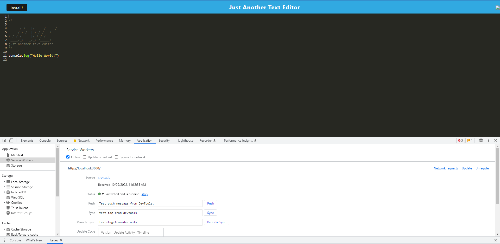

# Text-Editor
[Link to application webpage](https://niklas-solomon-text-editor.herokuapp.com/)
## Goal:
The goal of this application is to create a text editor that utilizes an IndexedDB database to store and retrieve text that is input by the user. The application will run in the browser and is functional with or without an internet connection. The application will be downloadable and saved as a PWA on the desktop.  

## How:
The application will use HtmlWebpackPlugin to generate the HTML and WebpackPwaManifest to generate the manifest file. The service worker is generated using the workbox. When the application is started, the idb will create a database storage and will save to that storage even when exiting the application. Workbox plugins for offlineFallback will be used to allow for offline functionality.  

## Result:
The text editor runs in the webpage and has a database that is saved and retrieved through idb. The application can be used offline and is downloadable as well.  

[Link to Github Repository](https://github.com/NiklasSolomon/Text-Editor)